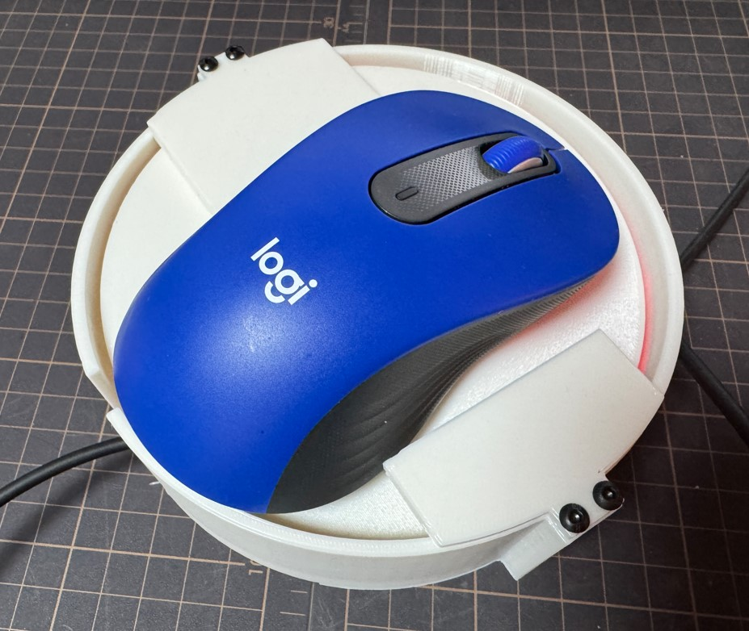
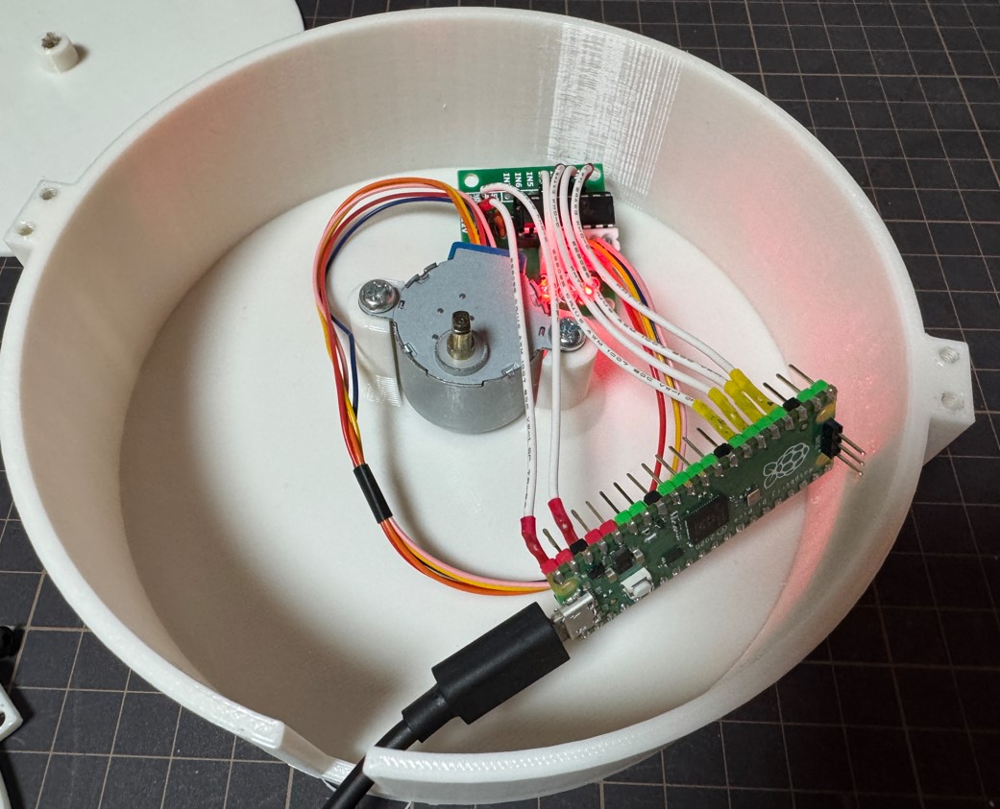
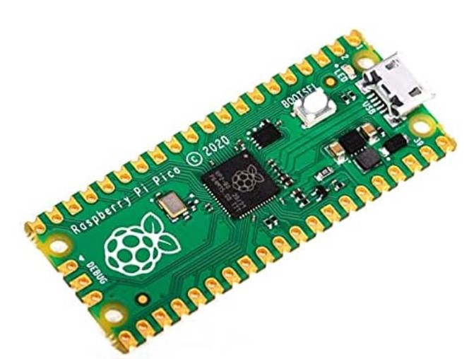
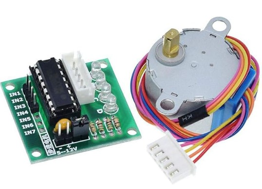
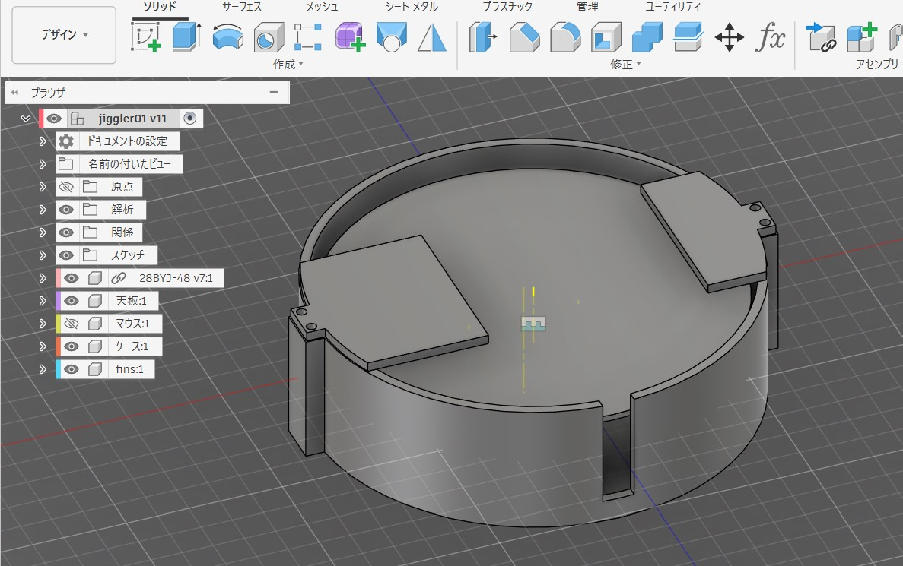
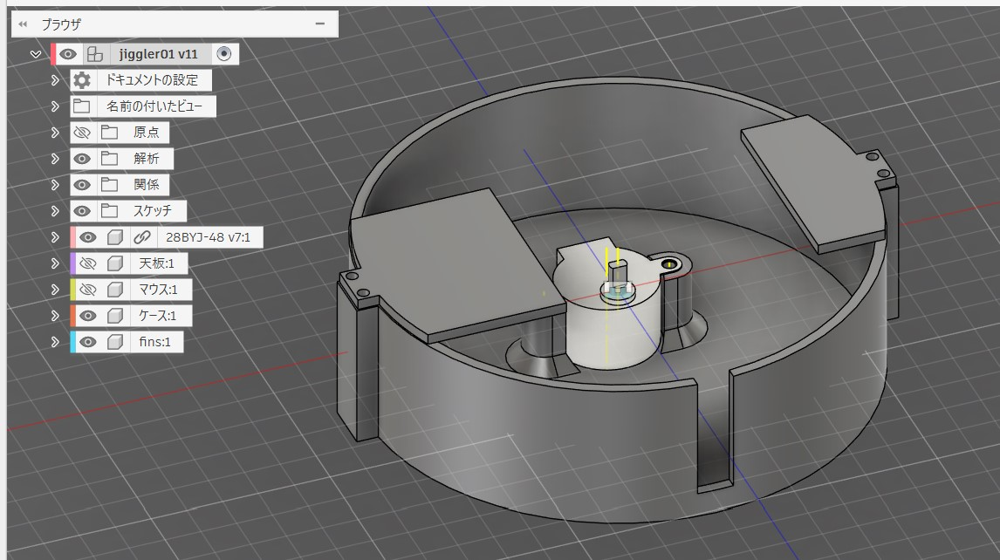
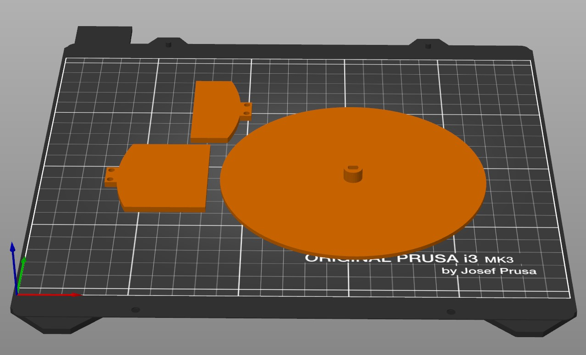

# Mouse Jiggler

ステッピングモーター28BYJ-48 5VとRaspberry Pi Picoを使ったジグラー



中身．ケーブルや基板などは適当に養生テープで固定すればOK



## BOM

|item|quentity||
|--|--|--|
|M4 5mm|2|screw|
|M3 5mm|2|screw|
|28BYJ-48|1|stepping motor|
|モータードライバ|1|ULN2003ドライバ|
|Raspberry Pi Pico|1|無線無しでOK|
|USBケーブル|1||

Picoは無線無しで安く済ませればOK．亜種基板でも最低限GPIO4本あればいけます．



とにかく安く簡単に済ませたいので，28BYJ-48とULN2003ドライバー基板を使います．



## CAD 3Dプリント

3D図は以下です．





3DプリンタはPrusa i3 MK3使ってますが，残念ながら入りきらなくて2回に分けて印刷．




stlフォルダにデータが入っている．

## 配線

|pico|UL2003ドライバ基板||
|--|--|--|
|VBUS|+|5V|
|GND|-||
|GP18|IN1||
|GP19|IN2||
|GP20|IN3||
|GP21|IN4||

## プログラム

### 開発環境

* VSCode
* VSCode MicroPico 拡張機能

* MicroPython

ファームウェアはMicroPythonを使用．使う基板用（Pico，Pico W, Pico2 etc）のものを必ず選択する．ファームウェアのインストール方法は省略．

https://www.raspberrypi.com/documentation/microcontrollers/micropython.html

* プログラム

main.pyのみで動作する．SLEEP_SECONDS，STEP_COUNT，DELAY_MSで速度とか実行間隔などを設定するが，実際動かしてみて調整する．実際の処理では，上記の値をランダムに散らして使用．

```python
# 動作の間隔（秒）
SLEEP_SECONDS = 10
# 512ステップで1周 360deg
STEP_COUNT=int(512/4)
# ステップ間の遅延（ms）
DELAY_MS = 10

# --- ピンの定義 ---
pin_in1 = Pin(18, Pin.OUT)
pin_in2 = Pin(19, Pin.OUT)
pin_in3 = Pin(20, Pin.OUT)
pin_in4 = Pin(21, Pin.OUT)

# --- 励磁パターンの定義 ---
# 1seq: 1相励磁
SEQUENCE1 = [
    [1, 0, 0, 0],
    [0, 1, 0, 0],
    [0, 0, 1, 0],
    [0, 0, 0, 1]
]
# 2seq: 2相励磁
SEQUENCE2 = [
    [1, 1, 0, 0],
    [0, 1, 1, 0],
    [0, 0, 1, 1],
    [1, 0, 0, 1]
]
CURRENT_SEQUENCE = SEQUENCE2
```

## その他

トルクも必要ないので1相励磁（SEQUENCE1）を指定している．
Picoとモーター，ドライバ含めて500mV以下だとは思うのでPCのUSB給電でも動作する．
心配ならUSBアダプターに接続して使用する．
